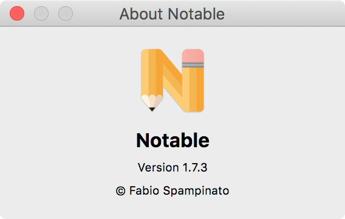

# Electron About

<p align="center">
  
</p>

Simple standalone about window for Electron.

## Install

```sh
npm install --save electron-about
```

## Usage

Adding an about window to your app is now as simple as calling a single function:

```ts
import * as path from 'path';
import About from 'electron-about';

function getMyAppMenu () {

  return [
    {
      label: 'Notable',
      submenu: [
        About.makeMenuItem ( 'Notable', {
          icon: `file://${path.join ( __static, 'images', 'icon.png' )}`,
          appName: 'Notable',
          version: 'Version 1.7.3',
          copyright: '© Fabio Spampinato'
        })
        // Other menu items...
      ]
    }
    // Other menu items...
  ];

}
```

## API

If you want more fine-grined control a few more advanced methods are provided.

The following types are provided:

```ts
type Options = {
  icon: string,
  appName: string,
  version: string,
  copyright: string
};
```

The following methods are provided:

### `.window`

The current about window, if any.

### `.focus ()`

Focus to the current about window.

### `.open ( options )`

Focus to the current about window, or create one and focus to it.

### `.close ()`

Close the current about window.

### `.makeMenuItem ( appName, options )`

Make a menu item which opens the about window.

### `.makeHTML ( options )`

Make the HTML which will be loaded into the about window.

Override this method to have custom content in your about window.

## License

MIT © Fabio Spampinato
